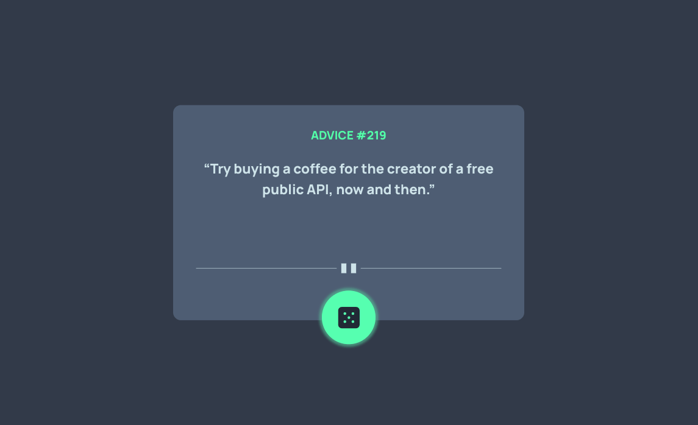

# Frontend Mentor - Advice generator app solution

This is a solution to the [Advice generator app challenge on Frontend Mentor](https://www.frontendmentor.io/challenges/advice-generator-app-QdUG-13db). Frontend Mentor challenges help you improve your coding skills by building realistic projects.

## Table of contents

- [Overview](#overview)
  - [The challenge](#the-challenge)
  - [Screenshot](#screenshot)
  - [Links](#links)
- [My process](#my-process)
  - [Built with](#built-with)
  - [What I learned](#what-i-learned)
  - [Continued development](#continued-development)
  - [Useful resources](#useful-resources)

## Overview

### The challenge

Users should be able to:

- Click the dice and get a piece of advice from an api.

### Screenshot

### Links

- Live Site URL: [Github Pages](https://jdegand.github.io/advice-generator-app)

## My process

### Built with

- Semantic HTML5 markup
- CSS custom properties

### What I learned

Easier to use box-shadow for the hover ripple effect since I used absolute positioning. 

### Continued development

- The api can return strings with encoding problems.
- Tweak the hover effect to be brighter 

### Useful resources

- [Advice Slip API](https://api.adviceslip.com/)
- [Free Frontend](https://freefrontend.com/css-ripple-effects/) - CSS ripple effects
- [Github](https://github.com/santivdt/quizzical/blob/2d90b75943bc180b620eec874ad1661803353a0b/utils/helpers.js#L1) - HTML Decode from here
- [Stack Overflow](https://stackoverflow.com/questions/2477452/%C3%A2%E2%82%AC-showing-on-page-instead-of) - encoding problems from api
- [Stack Overflow](https://stackoverflow.com/questions/60766000/using-absolute-relative-positioning-with-css-pseudo-elements) - absolute positioning and pseudo elements
- [i18nqa](https://www.i18nqa.com/debug/utf8-debug.html) - UTF8 Debug
- [Stack Overflow](https://stackoverflow.com/questions/13356493/decode-utf-8-with-javascript) - decode utf8 with js
